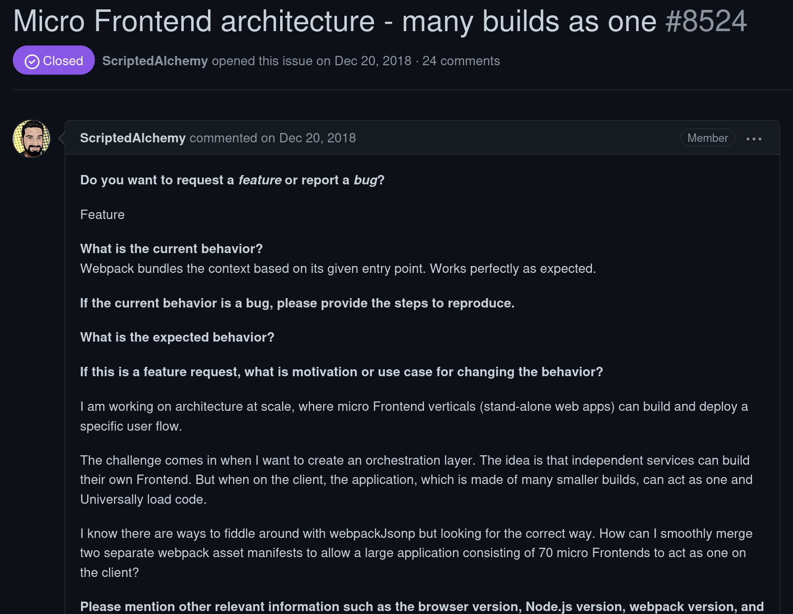

<!-- .slide: data-background="lime" -->
# What is Module Federation?


<!-- .slide: data-background="lime" -->
- New concept for sharing code between different bundles.

- First introduced in Webpack 5.

- Now also available as a framework agnostic library.


<!-- .slide: data-background="lime" -->
## Actually, what is a bundle?


<!-- .slide: data-background="lime" -->
- A bundle is a compiled JavaScript application.

- A collection of different JavaScript files,

- which are necessary to run the application,

- Eventually in one big blob,

- Or in smaller chunks on top which knows where to find what.


<!-- .slide: data-background="lime" -->


<!-- .slide: data-background="lime" -->
## What does it solve?


<!-- .slide: data-background="lime" -->
- Think of 2 differnt JavaScript applications provides as a bundle.

- Both have a dependency on Patternslib.

- Both are loaded in the Browser.


<!-- .slide: data-background="lime" -->
```html
<script src="./bundle-1.js"></script>
<script src="./bundle-2.js"></script>
```


<!-- .slide: data-background="lime" -->


<!-- .slide: data-background="lime" -->
- Shared dependencies are only loaded once.
- Bundles can depend on modules from another bundle.


<!-- .slide: data-background="Yellow" -->
## A bit of history


<!-- .slide: data-background="Yellow" -->
Zack Jackson, 2018, [webpack GH issue #8524](https://github.com/webpack/webpack/issues/8524) 


<!-- .slide: data-background="Yellow" -->


<!-- .slide: data-background="Yellow" -->



<!-- .slide: data-background="Yellow" -->
- Wanted to build a web application
- Based on many mini applications - "micro frontends"
- Each depending on React
- Didn't work.


<!-- .slide: data-background="Yellow" -->
- Zack implemented his idea
- [Webpack PR #10351](https://github.com/webpack/webpack/issues/10352)
- Early 2020.


<!-- .slide: data-background="Yellow" -->


<!-- .slide: data-background="Yellow" -->
- Multiple small applications works together as if they were one.
- Suited for Front- and Backend.
- Big teams work on many small apps.


<!-- .slide: data-background="Blue" -->
## Module Federation in Plone


<!-- .slide: data-background="Blue" -->
- [PLIP 3211 - Mockup Redone](https://github.com/plone/Products.CMFPlone/issues/3211) was already in progress.
- Problem of integrating Add-Ons.


<!-- .slide: data-background="Blue" -->


<!-- .slide: data-background="Blue" -->


<!-- .slide: data-background="Blue" -->
Then at Ploneconf 2020:


<!-- .slide: data-background="Blue" -->


<!-- .slide: data-background="Blue" -->
A year later...


<!-- .slide: data-background="Blue" -->


<!-- .slide: data-background="Blue" -->


<!-- .slide: data-background="Blue" -->


<!-- .slide: data-background="Blue" -->
And at Ploneconf 2021:


<!-- .slide: data-background="Blue" -->


<!-- .slide: data-background="Blue" -->
But still not working.


<!-- .slide: data-background="Blue" -->
Manfred Steyer helped out


<!-- .slide: data-background="Blue" -->


<!-- .slide: data-background="Blue" -->


<!-- .slide: data-background="Blue" -->


<!-- .slide: data-background="Blue" -->


<!-- .slide: data-background="Blue" -->


<!-- .slide: data-background="Blue" -->


<!-- .slide: data-background="Cyan" -->
# A minimal example


<!-- .slide: data-background="Cyan" -->
https://github.com/thet/module-federation-minimaltest


<!-- .slide: data-background="Cyan" -->


<!-- .slide: data-background="Cyan" -->
... show code


<!-- .slide: data-background="Cyan" -->
## Result


<!-- .slide: data-background="Cyan" data-transition="none" -->


<!-- .slide: data-background="Cyan" data-transition="none" -->


<!-- .slide: data-background="Cyan" data-transition="none" -->


<!-- .slide: data-background="Cyan" data-transition="none" -->


<!-- .slide: data-background="Cyan" data-transition="none" -->


<!-- .slide: data-background="Blue" -->
# Integration in Plone


<!-- .slide: data-background="Blue" -->
Base webpack configuration files:

[`@patternslib/dev`](https://github.com/patternslib/dev)


<!-- .slide: data-background="Blue" -->
Module Federation main - or host - bundle:

[`@plone/mockup`](https://github.com/plone/mockup/)


<!-- .slide: data-background="Blue" -->
- All bundles registered under common prefix.

- Host bundle initializes all bundles with that prefix.

- No bundle needs to know from each other.


<!-- .slide: data-background="Blue" -->
... Show code


<!-- .slide: data-background="DarkViolet" -->
When creating new Plone addons, use bobtemplates.plone >= 6.0b14/6.0b15:

https://github.com/plone/bobtemplates.plone


<!-- .slide: data-background="DarkViolet" -->
When creating only a Pattern, use pat-PATTERN_TEMPLATE:

https://github.com/Patternslib/pat-PATTERN_TEMPLATE


<!-- .slide: data-background="Purple" data-background-image="./resources/imgs/thats_all_folks.svg" -->
